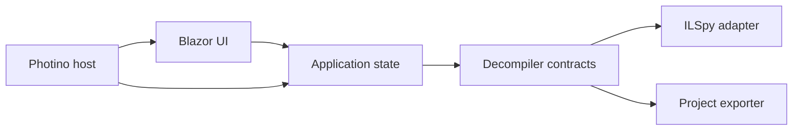

# Application architecture



Keep Photino at the edge. Razor components should not call `PEFile`, `CSharpDecompiler`, or the filesystem directly.

### Suggested solution layout

```text
DnSpyXDX.slnx
Directory.Build.props
Directory.Packages.props
src/
  DecompilerApp.Host/
    Program.cs
    DecompilerApp.Host.csproj
  DecompilerApp.UI/
    Components/
    Layout/
    wwwroot/
      js/codeEditor.js
      css/app.css
    DecompilerApp.UI.csproj
  DecompilerApp.Application/
    Assemblies/
    Documents/
    Navigation/
    Search/
    Export/
    DecompilerApp.Application.csproj
  DecompilerApp.Decompilation/
    IlSpyDecompilerBackend.cs
    AssemblySession.cs
    MetadataTreeBuilder.cs
    ReferenceResolver.cs
    DecompilerApp.Decompilation.csproj
  DecompilerApp.Export/
    ProjectExportService.cs
    SlnxWriter.cs
    ExportReport.cs
    DecompilerApp.Export.csproj
tests/
  DecompilerApp.Decompilation.Tests/
  DecompilerApp.Export.Tests/
  DecompilerApp.UI.Tests/
  TestAssemblies/
```

The host project is the executable and composition root. It creates the Photino window, configures dependency injection, catches top-level errors, restores window state, and owns shutdown. The UI project is a Razor class library so most UI logic can be tested without starting a native window.

### Core contracts

Keep the application layer independent of ILSpy-specific classes:

```csharp
public readonly record struct SymbolId(Guid ModuleMvid, int MetadataToken);

public sealed record DecompilerDocument(
    SymbolId Symbol,
    string Title,
    string Language,
    string Text,
    IReadOnlyList<ReferenceSpan> References,
    IReadOnlyList<DiagnosticMessage> Diagnostics);

public interface IDecompilerBackend : IAsyncDisposable
{
    Task<AssemblyDescriptor> OpenAsync(string path, CancellationToken cancellationToken);
    Task<IReadOnlyList<TreeNodeDescriptor>> GetChildrenAsync(
        NodeId parent,
        CancellationToken cancellationToken);
    Task<DecompilerDocument> DecompileAsync(
        SymbolId symbol,
        CancellationToken cancellationToken);
}

public interface IProjectExportService
{
    Task<ExportReport> ExportAsync(
        ExportRequest request,
        IProgress<ExportProgress>? progress,
        CancellationToken cancellationToken);
}
```

Use `(module MVID, metadata token)` as the in-memory identity for types and members. Names are unsuitable identifiers because assemblies can contain overloads, nested types, duplicated names in different namespaces, and obfuscated identifiers.
