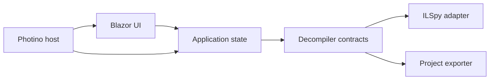

# Building a Cross-Platform dnSpy-Style Decompiler with Photino and Blazor

> Target: .NET 10, C#, Windows x64, and Linux x64  
> Initial scope: open managed assemblies, browse types and members, decompile C#, navigate symbols, and export one or more assemblies as SDK-style projects in an `.slnx` solution.

## 1. Recommendation

Build a new application inspired by dnSpy's workflow rather than trying to port dnSpy's WPF application.

Use:

- **Photino.Blazor** for the native window and Blazor UI host.
- **ICSharpCode.Decompiler** for metadata inspection, C# decompilation, and whole-project export.
- **System.Reflection.Metadata** types exposed by the decompiler package for stable metadata handles and tokens.
- **Monaco Editor** or CodeMirror 6 as the read-only source viewer. Monaco gives the closest IDE-like result.
- A small application layer that owns open assemblies, tabs, navigation history, cancellation, and export jobs.

Do not load inspected DLLs with `Assembly.Load`, `AssemblyLoadContext`, or reflection. Parse them as PE/metadata files only. This keeps opening a DLL independent of its runtime dependencies and avoids executing module initializers or other assembly code.

### Why not port dnSpy directly?

dnSpy is a large, mature debugger and assembly editor built around WPF, MEF, dnlib, Roslyn, and its own desktop service contracts. Its repository separates contracts, decompiler integrations, debugger components, and the application shell, but much of the UI and composition model is Windows-oriented. Replacing WPF while retaining the rest would be a major port, not a UI rewrite.

The dnSpyEx repository is also GPLv3. Copying or adapting its implementation would bring GPL distribution obligations. Treating its feature set and interaction model as inspiration while writing a new implementation around the MIT-licensed `ICSharpCode.Decompiler` package gives a much cleaner technical and licensing boundary. This is an engineering observation, not legal advice.

## 2. Scope the first release carefully

### MVP

The first useful release should support:

1. Open a `.dll` or managed `.exe` from a native file dialog.
2. Reject native-only or invalid PE files with a clear error.
3. Display an expandable tree:
   - assembly/module
   - references and resources
   - namespaces
   - types
   - fields, properties, events, constructors, and methods
4. Decompile a selected type or member to C# without blocking the UI.
5. Open decompiled documents in tabs.
6. Navigate back/forward and from a method to its declaring type.
7. Navigate clickable type/member references when the target exists in an open assembly.
8. Search by type/member name across open assemblies.
9. Export a selected assembly to an SDK-style `.csproj` and C# files.
10. Export multiple opened assemblies as projects inside one `.slnx`.
11. Publish and smoke-test self-contained `win-x64` and `linux-x64` builds.

### Explicitly defer

Do not include these in the first release:

- debugging or attaching to processes
- editing and rewriting assemblies
- compiling edited C# back into a DLL
- IL editing, metadata table editing, or a hex editor
- BAML-to-XAML reconstruction
- caller/callee analysis
- extension/plugin loading
- Unity-specific debugger support

Those are separate products' worth of complexity. The architecture below leaves room for them without making the first release depend on them.

## 3. Proposed architecture



Keep Photino at the edge. Razor components should not call `PEFile`, `CSharpDecompiler`, or the filesystem directly.

### Suggested solution layout

```text
DnSpyXDX.slnx
Directory.Build.props
Directory.Packages.props
src/
  DecompilerApp.Host/
    Program.cs
    DecompilerApp.Host.csproj
  DecompilerApp.UI/
    Components/
    Layout/
    wwwroot/
      js/codeEditor.js
      css/app.css
    DecompilerApp.UI.csproj
  DecompilerApp.Application/
    Assemblies/
    Documents/
    Navigation/
    Search/
    Export/
    DecompilerApp.Application.csproj
  DecompilerApp.Decompilation/
    IlSpyDecompilerBackend.cs
    AssemblySession.cs
    MetadataTreeBuilder.cs
    ReferenceResolver.cs
    DecompilerApp.Decompilation.csproj
  DecompilerApp.Export/
    ProjectExportService.cs
    SlnxWriter.cs
    ExportReport.cs
    DecompilerApp.Export.csproj
tests/
  DecompilerApp.Decompilation.Tests/
  DecompilerApp.Export.Tests/
  DecompilerApp.UI.Tests/
  TestAssemblies/
```

The host project is the executable and composition root. It creates the Photino window, configures dependency injection, catches top-level errors, restores window state, and owns shutdown. The UI project is a Razor class library so most UI logic can be tested without starting a native window.

### Core contracts

Keep the application layer independent of ILSpy-specific classes:

```csharp
public readonly record struct SymbolId(Guid ModuleMvid, int MetadataToken);

public sealed record DecompilerDocument(
    SymbolId Symbol,
    string Title,
    string Language,
    string Text,
    IReadOnlyList<ReferenceSpan> References,
    IReadOnlyList<DiagnosticMessage> Diagnostics);

public interface IDecompilerBackend : IAsyncDisposable
{
    Task<AssemblyDescriptor> OpenAsync(string path, CancellationToken cancellationToken);
    Task<IReadOnlyList<TreeNodeDescriptor>> GetChildrenAsync(
        NodeId parent,
        CancellationToken cancellationToken);
    Task<DecompilerDocument> DecompileAsync(
        SymbolId symbol,
        CancellationToken cancellationToken);
}

public interface IProjectExportService
{
    Task<ExportReport> ExportAsync(
        ExportRequest request,
        IProgress<ExportProgress>? progress,
        CancellationToken cancellationToken);
}
```

Use `(module MVID, metadata token)` as the in-memory identity for types and members. Names are unsuitable identifiers because assemblies can contain overloads, nested types, duplicated names in different namespaces, and obfuscated identifiers.

## 4. Opening and indexing an assembly

An `AssemblySession` should own all disposable metadata/decompiler state for one opened file:

1. Normalize and validate the path.
2. Open it with `PEFile`, never reflection.
3. Confirm it contains CLI metadata.
4. Read the module MVID, assembly name, target framework, architecture, entry point, references, and resources.
5. Create a `UniversalAssemblyResolver`.
6. Add probe paths in this order:
   - the opened assembly's directory
   - user-configured reference directories
   - directories of other assemblies opened in the workspace
   - installed .NET reference/shared-framework locations when appropriate
7. Build only the top-level tree immediately.
8. Lazily enumerate namespaces, types, and members as tree nodes expand.

Illustrative setup:

```csharp
var peFile = new PEFile(path, PEStreamOptions.PrefetchEntireImage);

var resolver = new UniversalAssemblyResolver(
    path,
    throwOnError: false,
    peFile.DetectTargetFrameworkId());

resolver.AddSearchDirectory(Path.GetDirectoryName(path)!);

var settings = new DecompilerSettings
{
    ThrowOnAssemblyResolveErrors = false
};

var decompiler = new CSharpDecompiler(peFile, resolver, settings);
```

Treat this as a shape, not copy-paste-complete production code: the exact constructor overloads should be locked to the chosen package version and covered by an integration test.

### Threading rule

`CSharpDecompiler` instances are not thread-safe. Do one of the following:

- serialize decompilation work per assembly session; or
- create a new decompiler instance for each concurrent request while sharing immutable configuration.

Start with one queue per session. It is simpler, bounds memory, and makes cancellation predictable. Allow separate assemblies to decompile concurrently up to a global limit such as `max(1, ProcessorCount - 1)`.

### Caching

Cache decompiled documents by:

```text
(file content fingerprint, metadata token, settings fingerprint, decompiler version)
```

Use a small in-memory LRU cache first. A disk cache can be added later. Clear session caches when the source file's length or last-write time changes; use a full hash before persisting results across application launches.

## 5. Decompilation and source navigation

### First implementation

Use the current stable `ICSharpCode.Decompiler` package and its `CSharpDecompiler` APIs:

- `DecompileTypeAsString(FullTypeName)` for a complete type document.
- `DecompileAsString(EntityHandle[])` for selected members.
- `DecompileWholeModuleAsString()` only for explicit whole-module operations; it can be expensive.

For the first vertical slice, display plain C# in a read-only Monaco model and navigate only from the tree and history.

### Clickable references

Do not try to recover references by regex-parsing the final C# text. That fails for overloads, aliases, generic types, operators, and ambiguous names.

Instead:

1. Ask the decompiler for a syntax tree for the selected definition.
2. Format it through a token writer/output visitor that records the character range of each identifier.
3. Read the semantic annotation or resolved entity associated with each relevant syntax node.
4. Convert the target entity to your own `SymbolId` plus assembly identity.
5. Return plain text and `ReferenceSpan` records to the UI.
6. Add Monaco decorations for those spans and handle Ctrl+click/double-click in JavaScript.

Use a data shape such as:

```csharp
public sealed record ReferenceSpan(
    int StartOffset,
    int Length,
    SymbolId? LocalTarget,
    AssemblyReferenceId? ExternalAssembly,
    string Tooltip);
```

If a reference points into an unopened dependency, show the target assembly name and offer to locate/open it. Never silently resolve to a same-named symbol in another module.

### Monaco integration

Keep Monaco behind one small JavaScript module:

- `createEditor(element, options)`
- `setDocument(id, text, spans)`
- `revealRange(start, length)`
- `setTheme(theme)`
- `disposeDocument(id)`

The Blazor side owns tabs and navigation state. JavaScript owns only editor models, view state, and mouse/keyboard events. Avoid rendering large source files as thousands of Razor DOM nodes.

## 6. Tree, tabs, and navigation state

### Tree

Use lazy loading and virtualization. A large Unity or application assembly can have tens of thousands of members; eagerly rendering the entire tree will make a WebView UI feel broken.

Recommended nodes:

```text
Assembly
├── References
├── Resources
└── Namespaces
    └── Namespace
        └── Type
            ├── Base types
            ├── Fields
            ├── Properties
            ├── Events
            ├── Constructors
            ├── Methods
            └── Nested types
```

Sort types and members deterministically. Preserve metadata order as an optional setting for reverse-engineering work.

### Tabs and history

Separate the selected tree node from the active document. A document tab should contain:

- document key and symbol ID
- title and assembly name
- decompiler settings fingerprint
- Monaco view state (cursor, selection, scroll position)
- loading/error/ready state

Navigation history entries should store the symbol, tab preference, caret range, and scroll position. Back and forward should restore view state without forcing a re-decompile when the cache is valid.

## 7. Exporting to projects and `.slnx`

`ICSharpCode.Decompiler` already includes `WholeProjectDecompiler`, project information APIs, and an `IProjectFileWriter` extension point. Use these instead of building a C# file splitter from scratch.

### Export pipeline

1. Validate that the destination is empty or create a new child directory. Never partially overwrite an existing project without explicit confirmation.
2. Create a staging directory beside the final destination.
3. For each selected module:
   - make a filesystem-safe, collision-free project directory name;
   - create a resolver with the same probe rules as the viewer;
   - run `WholeProjectDecompiler` with cancellation and progress;
   - emit SDK-style source/resources and a `.csproj`;
   - record warnings for failed members or resources rather than losing the whole report.
4. Map references between selected modules.
5. Where safe, replace a binary `<Reference>` with a `<ProjectReference>` to the corresponding exported project.
6. Emit a root `.slnx`.
7. Move the completed staging directory into place atomically when the filesystem permits it.
8. If a .NET SDK is installed, offer **Validate export** by running `dotnet build` as a separate, cancellable process.
9. Save `export-report.json` or `export-report.md` containing unresolved references, decompilation failures, resource warnings, and build output.

### Minimal `.slnx`

.NET 10 defaults to `.slnx`. A valid simple solution can be written without invoking the CLI:

```xml
<Solution>
  <Project Path="src/LibraryA/LibraryA.csproj" />
  <Project Path="src/LibraryB/LibraryB.csproj" />
</Solution>
```

Use `XmlWriter`, normalized forward slashes, relative paths, deterministic ordering, and no machine-specific absolute paths. You can alternatively invoke `dotnet new sln` and `dotnet sln add`, but direct XML generation allows export on machines that have the self-contained app without the .NET SDK.

### Important expectation

"Export to solution" means reconstructing a best-effort buildable project, not recovering the author's original project. The original package references, conditional MSBuild logic, source generators, analyzers, signing keys, source file boundaries, comments, and exact project settings are not stored completely in the DLL.

The UI should distinguish:

- **Export completed** — files and `.slnx` were written.
- **Validation succeeded** — `dotnet build` returned success.
- **Export completed with warnings** — files exist, but references/resources/members need manual work.

## 8. Packages and version policy

Start with centrally managed packages in `Directory.Packages.props`.

| Purpose | Package/asset | Initial policy |
| --- | --- | --- |
| Window + Blazor host | `Photino.Blazor` | Start with stable 4.0.13; prove .NET 10 on both OSes in Phase 0 |
| Decompiler | `ICSharpCode.Decompiler` | Start with stable 10.1.1.8388; do not take an 11 preview for the MVP |
| Logging | `Microsoft.Extensions.Logging` | Match .NET 10 |
| Options/DI | `Microsoft.Extensions.*` | Match .NET 10 |
| Source viewer | Monaco Editor | Pin and vendor/build the required browser assets |
| Unit tests | xUnit or NUnit | Use the team's preference |
| Assertions | FluentAssertions or built-in asserts | Optional |

Photino.Blazor currently targets .NET 8 and is compatible with a .NET 10 consuming project, but compatibility should be demonstrated, not assumed. Photino's last stable NuGet release predates .NET 10, and the project publicly noted a maintenance/workflow transition in 2026. Make the host replaceable and keep all useful code outside it.

Avoid referencing dnSpy's fork of ILSpy or dnSpy contracts unless you intentionally accept the resulting coupling and licensing analysis. The upstream `ICSharpCode.Decompiler` package is the cleaner dependency.

## 9. Cross-platform design and packaging

### Project target

Use a common target framework:

```xml
<PropertyGroup>
  <TargetFramework>net10.0</TargetFramework>
  <Nullable>enable</Nullable>
  <ImplicitUsings>enable</ImplicitUsings>
  <TreatWarningsAsErrors>true</TreatWarningsAsErrors>
  <PlatformTarget>x64</PlatformTarget>
</PropertyGroup>
```

Do not use `net10.0-windows` in shared projects. If a Windows-only helper is ever required, put it in a separate adapter loaded only on Windows.

### Runtime builds

Start with framework-dependent builds during development and self-contained folder publishes for releases:

```bash
dotnet publish src/DecompilerApp.Host -c Release -r win-x64 \
  --self-contained true -p:PublishSingleFile=false

dotnet publish src/DecompilerApp.Host -c Release -r linux-x64 \
  --self-contained true -p:PublishSingleFile=false
```

Do not enable trimming, Native AOT, or single-file publishing initially. Decompiler code, Blazor assets, and Photino's native library loading all deserve dedicated tests before those optimizations.

### Native UI dependencies

- Windows uses WebView2. Detect a missing runtime and show an actionable installation message.
- Linux uses GTK 3, WebKitGTK 4.1, and libnotify in the current Photino native build. Package names vary by distribution. Document Debian/Ubuntu and Arch/CachyOS prerequisites in release notes and fail clearly when a native library cannot be loaded.
- Use native file/folder dialogs exposed by Photino where reliable. Hide them behind `IFileDialogService` so a small platform-specific implementation can replace them if needed.
- Use `Path`, `Path.GetRelativePath`, and `StringComparer` choices deliberately. Linux paths are case-sensitive; Windows paths normally are not.

### CI matrix

At minimum:

| Job | What it proves |
| --- | --- |
| Windows x64 build/test/publish | .NET, WebView2 host, native asset layout |
| Linux x64 build/test/publish | .NET, Photino `.so`, WebKitGTK/GTK dependencies |
| Export golden tests | deterministic `.cs`, `.csproj`, `.slnx`, and report output |
| GUI smoke test | window starts, sample DLL opens, a type renders |

For Linux GUI CI, use an image with GTK/WebKitGTK installed and run the smoke test under Xvfb or a suitable headless compositor. Also test manually on Wayland because browser-control and native-dialog behavior can differ from X11.

## 10. Reliability and security

Assemblies are untrusted input. Even when no code is executed, malformed or adversarial metadata can cause exceptions, high memory use, deep recursion, or very slow decompilation.

Implement from the start:

- cancellation tokens for open, tree enumeration, decompile, search, and export
- global and per-session concurrency limits
- maximum source/document sizes before showing a confirmation
- structured error results rather than UI-thread exceptions
- logging without dumping proprietary decompiled source by default
- atomic export through a staging directory
- path sanitization for namespaces, types, resources, and obfuscated names
- prevention of `..`, rooted paths, reserved Windows names, and case-collision overwrites
- a crash-recovery/session file that stores paths and UI state, not assembly bytes

For a hardened later release, move decompilation and export into a worker process with a memory limit and restart policy. Define the backend interface now so this can be introduced without changing Razor components.

## 11. Testing strategy

Create small source projects in `tests/TestAssemblies` and compile them during the test build. Cover:

- class library and console executable
- generics, nested types, overloads, async/iterator state machines
- records, required members, primary constructors, extension members supported by the chosen compiler
- enums, attributes, explicit interface implementations, operators, events, and indexers
- embedded resources and satellite assemblies
- missing dependency and mismatched dependency version
- duplicate assembly/type names in separate files
- invalid PE, native PE, truncated DLL, and obfuscated/pathological identifiers
- .NET Framework, .NET Standard, and modern .NET targets

Assertions should focus on semantic behavior, not exact whitespace for every decompiler version. Golden tests are appropriate for the `.slnx`, stable project structure, symbol spans, and path sanitization. Keep a small set of exact decompilation snapshots pinned to the package version to detect unexpected upgrades.

### MVP acceptance test

On both Windows x64 and Linux x64:

1. Launch the published application.
2. Open a known test DLL.
3. Expand a namespace and type.
4. Open two overloaded methods in separate tabs.
5. Ctrl+click a referenced local type and use Back to return.
6. Search for a method and open it.
7. Export the assembly.
8. Confirm a `.csproj`, `.cs` files, `.slnx`, and export report exist.
9. With the .NET 10 SDK installed, validate the solution with `dotnet build`.

## 12. Phased implementation plan

The estimates below assume one experienced C# developer working mostly full-time. They are planning ranges, not commitments.

| Phase | Deliverable | Estimate | Exit condition |
| --- | --- | ---: | --- |
| 0. Feasibility spike | Photino + Blazor + .NET 10 shell; ILSpy package loads a test DLL on both OSes | 2–4 days | Same branch launches and decompiles one type on Windows and Linux |
| 1. Application skeleton | Project split, DI, logging, settings, native dialogs, CI builds | 3–5 days | Clean publish artifacts for both RIDs |
| 2. Assembly workspace | Open/close sessions, lazy virtualized tree, metadata/error views | 1–2 weeks | Large test assembly is browsable without UI stalls |
| 3. Decompiled documents | Monaco, type/member decompilation, tabs, caching, cancellation | 1–2 weeks | Stable type/member viewing and tab restoration |
| 4. Navigation and search | Symbol IDs, history, semantic spans, Ctrl+click, indexed name search | 1–2 weeks | Navigation acceptance tests pass |
| 5. Project and `.slnx` export | Whole-project adapter, staging, multi-project mapping, reports, optional build | 1–2 weeks | One- and multi-assembly exports are deterministic and validated |
| 6. Hardening | Malformed inputs, resource/path safety, memory/concurrency controls, recovery | 1–2 weeks | Adversarial fixture suite cannot corrupt output or freeze UI indefinitely |
| 7. Release engineering | installers/archive layout, prerequisites, licenses, smoke tests, docs | 3–5 days | Reproducible Windows/Linux x64 release candidate |

A realistic read-only MVP is approximately **6–10 weeks** for one developer. Semantic source hyperlinks and reliable multi-project export are the two areas most likely to move the schedule.

## 13. First implementation backlog

Build these tickets in order:

1. Create the .NET 10 solution and Photino.Blazor host.
2. Add a Razor three-pane shell: assembly tree, source tabs, status/output panel.
3. Add `IDecompilerBackend` and a test fake.
4. Implement `AssemblySession` with `PEFile` and `UniversalAssemblyResolver`.
5. Show assembly metadata, references, namespaces, and types lazily.
6. Decompile a selected type into a plain read-only source view.
7. Integrate Monaco and preserve model/view state per tab.
8. Add member nodes and member-level decompilation.
9. Add cancellation, progress, error documents, and an LRU cache.
10. Implement history and symbol identity.
11. Add semantic reference spans and editor navigation.
12. Add workspace-wide name search.
13. Export one assembly with `WholeProjectDecompiler`.
14. Add `SlnxWriter`, multi-project export, and project-reference mapping.
15. Add optional `dotnet build` validation and a persistent export report.
16. Add Windows/Linux publishing and GUI smoke tests.

## 14. Decisions to lock before Phase 1

Record these as architecture decision records:

1. **License:** proprietary/permissive/GPL application, and how third-party notices are shipped.
2. **Source viewer:** Monaco versus CodeMirror.
3. **Supported inputs:** modern managed PE only, or best-effort .NET Framework/Unity assemblies too.
4. **Export unit:** one selected assembly, all open assemblies, and/or recursively resolved local dependencies.
5. **Validation:** whether the app merely exports or also promises a build attempt when an SDK exists.
6. **Isolation:** in-process decompilation for MVP versus a worker process from day one.

Recommended initial answers: permissive original code, Monaco, best-effort .NET Framework plus modern .NET, selected/open assemblies only, optional validation, and in-process MVP behind a worker-ready interface.

## 15. Future roadmap after the MVP

Add capabilities in this order:

1. IL disassembly view.
2. Analyzer: callers, callees, type uses, derived types, and interface implementations.
3. Resource viewer and extraction.
4. Assembly diff and API diff.
5. PDB/source-link awareness.
6. BAML/XAML support.
7. Out-of-process hardened worker.
8. Assembly editing with dnlib and save-as semantics.
9. Roslyn-based C# editing/compilation.
10. Debugging as a separate subsystem.

Assembly editing changes the product's risk profile: it requires metadata preservation, strong-name handling, deterministic backups, verification, and extensive round-trip testing. Do not let it leak into the read-only MVP abstractions prematurely.

## 16. Primary references checked

- [dnSpyEx/dnSpy repository and feature list](https://github.com/dnSpyEx/dnSpy)
- [dnSpy decompiler project layout](https://github.com/dnSpyEx/dnSpy/tree/master/dnSpy/dnSpy.Decompiler)
- [Photino.NET repository](https://github.com/tryphotino/photino.NET)
- [Photino architecture and platform web controls](https://www.tryphotino.io/)
- [Photino NuGet profile](https://www.nuget.org/profiles/Photino)
- [Photino.Native Linux build dependencies](https://github.com/tryphotino/photino.Native/blob/master/makefile)
- [ILSpy repository and supported features](https://github.com/icsharpcode/ILSpy)
- [ICSharpCode.Decompiler stable NuGet package](https://www.nuget.org/packages/ICSharpCode.Decompiler/)
- [`CSharpDecompiler` implementation/API](https://github.com/icsharpcode/ILSpy/blob/master/ICSharpCode.Decompiler/CSharp/CSharpDecompiler.cs)
- [`WholeProjectDecompiler` implementation/API](https://github.com/icsharpcode/ILSpy/blob/master/ICSharpCode.Decompiler/CSharp/ProjectDecompiler/WholeProjectDecompiler.cs)
- [`IProjectFileWriter` extension point](https://github.com/icsharpcode/ILSpy/blob/master/ICSharpCode.Decompiler/CSharp/ProjectDecompiler/IProjectFileWriter.cs)
- [.NET 10 `.slnx` default behavior](https://learn.microsoft.com/en-us/dotnet/core/compatibility/sdk/10.0/dotnet-new-sln-slnx-default)
- [`dotnet sln` command and `.slnx` support](https://learn.microsoft.com/en-us/dotnet/core/tools/dotnet-sln)
